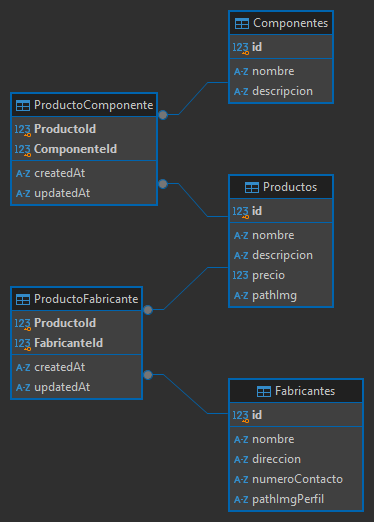

Para ejecutar la API: 
-usar "npm run dev"
-abrir el archivo "database_development.sqlite" ubicado en la carpeta "data" con algún motor.

Importante para usar la API:
- A la hora de usar alguno de los POST "/productos/:id/componentes" o "/productos/:id/fabricantes" tener en cuenta que el body debe ser un JSON escrito con el siguiente formato según lo que se quiera usar:
    Para /productos/:id/componentes el JSON del cuerpo debe ser:
        {
            "componenteIds": [11,12]
        }
    donde "[11,12]" pueden ser cualquier ID deseada de componentes.
    
    Para /productos/:id/fabricantes el JSON del cuerpo debe ser:
        {
            "fabricanteIds": [1,2]
        }
    donde "[1,2]" pueden ser cualquier ID deseada de fabricantes.
